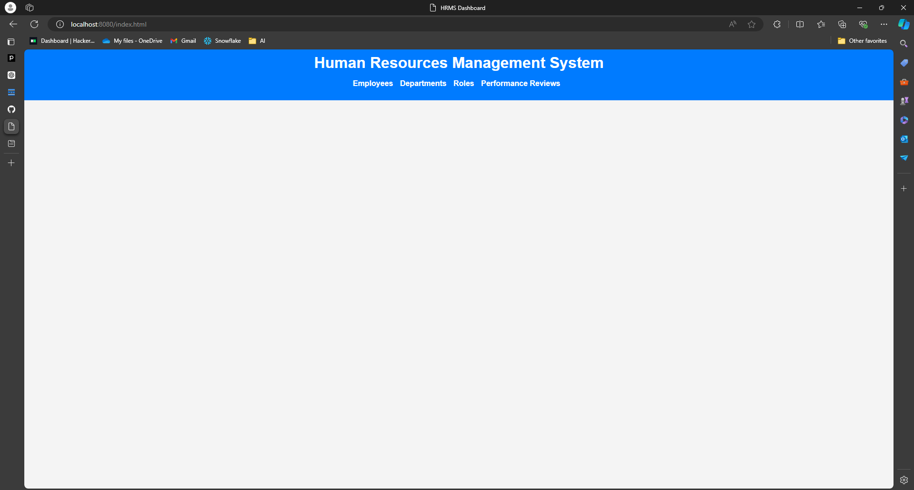
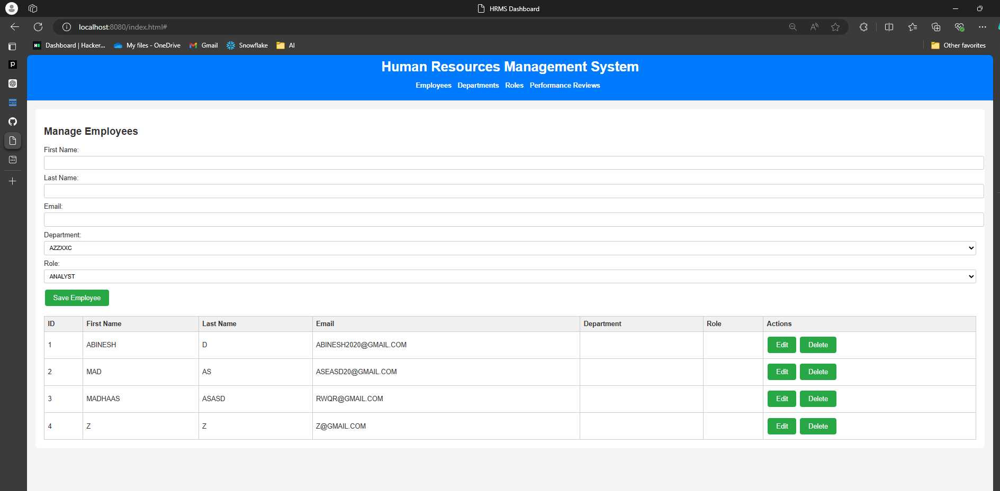
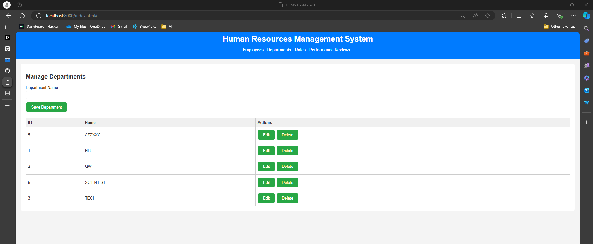
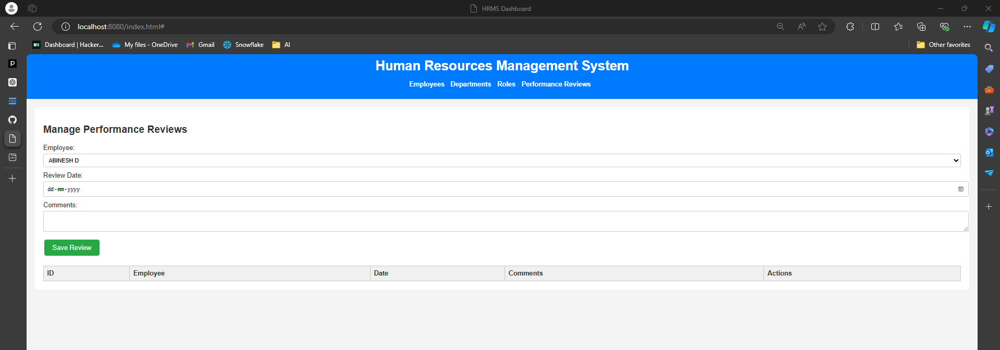

# Human Resources Management System (HRMS) Dashboard

The HRMS Dashboard is a web application designed to streamline human resources management within an organization. It offers comprehensive features for managing employees, departments, roles, and performance reviews efficiently.

## Accessing the Application

Once the application is deployed and running, access the HRMS Dashboard at:

- **URL:** [http://localhost:8080/index.html](http://localhost:8080/index.html)

## Features

### Employee Management
- **Add, Edit, and Delete Employees:** Manage employee details such as first name, last name, email, department, and role assignments.
- **Assign Departments and Roles:** Directly assign departments and roles to employees from the employee management section.

### Department Management
- **Create, Update, and Remove Departments:** Administer organizational departments seamlessly.

### Role Management
- **Manage Roles:** Define roles within the organization and assign them to employees as required.

### Performance Reviews
- **Add, Edit, and Delete Reviews:** Manage performance reviews for employees, with options to add comments and specify review dates.
- **Employee Selection:** Utilize a dropdown populated with current employees to select the employee for whom a review is being entered.

## Sections

The dashboard is structured into the following main sections:

- **Employees:** Manage employee information and assignments.
- **Departments:** Create and administer organizational departments.
- **Roles:** Define and assign roles to employees.
- **Performance Reviews:** Enter and manage performance reviews for employees.

## Usage

- **Navigation:** Use the navigation bar at the top of the page to switch between different sections.
- **Forms:** Use forms provided in each section to add new entries or update existing information.
- **Tables:** View and interact with current data displayed in tables, with options to edit or delete entries.
- **Dropdowns:** Dynamically populated dropdowns facilitate easy selection of departments, roles, and employees.

## Technology Stack

- **Frontend:** HTML, CSS, JavaScript
- **Backend:** Spring Boot (assumed based on context)
- **API Endpoints:** 
  - `/api/employees` for managing employees
  - `/api/departments` for managing departments
  - `/api/roles` for managing roles
  - `/api/reviews` for managing performance reviews

## Running the Application

To run the application:

1. **Backend Setup:** Configure your Spring Boot backend to serve the static content (HTML, CSS, JavaScript) from the `src/main/resources/static` directory.

## Screenshots

*Screenshot 1: Result of the Application.*

*Screenshot 2: Result of the Application.*

*Screenshot 3: Result of the Application.*

*Screenshot 4: Result of the Application.*

## Contact

For questions or feedback, please contact [abinesh] at [abineshpcm@gmail.com].

